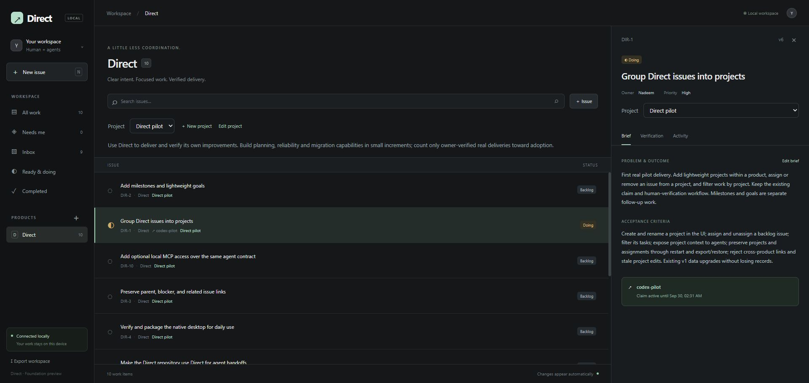

# DIR-1 developer verification — 29 September 2026

Story: the owner creates a product-scoped project in the UI; agents assign work through the local service; the interface filters the same persisted assignments and the archive restores them without loss.

| Boundary | Evidence |
| --- | --- |
| UI → service | Created `Direct development`, then renamed it to `Direct pilot` through the browser; CLI returned the same project ID at version 2. |
| Agent → UI | Grouped all ten real pilot issues through the agent CLI; the open project filter changed from zero to ten without reloading. |
| WSL → service | The Windows CLI bridge returned DIR-1 in Doing at version 6, with its active `codex-pilot` claim and `Direct pilot` project context. |
| UI assignment/filter | Removed DIR-2 from its project: project filter showed nine, No project showed one. Reassigned it: No project showed zero. |
| Data upgrade | Normal workspace upgraded from schema 1 with all ten issues and DIR-1's active claim preserved. A pre-upgrade archive was saved outside Git. |
| Recovery | Exported and restored the real pilot into a separate directory, started the restored service, re-exported and compared SHA-256 hashes. Archives were byte-identical: ten issues, one project, 37 events at that checkpoint. |
| Repeatability | Reran the initial backlog seeder; issue count and event cursor were unchanged. |

Eight Rust integration tests pass (three project/compatibility tests, four workflow tests, one real HTTP test). New cases cover owner-only project edits, stale versions, exact retries, cross-product assignments, active claims, verification-child inheritance, old database/archive upgrades, and rejection of malformed project references without changing the destination.

Workspace Clippy and Rust formatting checks pass. Svelte reports zero errors and zero warnings; the frontend and embedded Tauri desktop builds succeed. The initial sandboxed Vite check could not traverse the Windows user directory; rerunning with normal user permissions passed. The initial Rust build encountered the old synthetic preview's executable lock; that identified preview process was stopped before the successful build.

These are developer checks, not owner acceptance. DIR-1 remains subject to the owner's manual review. Native desktop interaction, milestones/goals, general relationships, routine backup scheduling and Linear migration are separate tasks. The successful recovery drill here does not implement routine backups or complete DIR-6.

