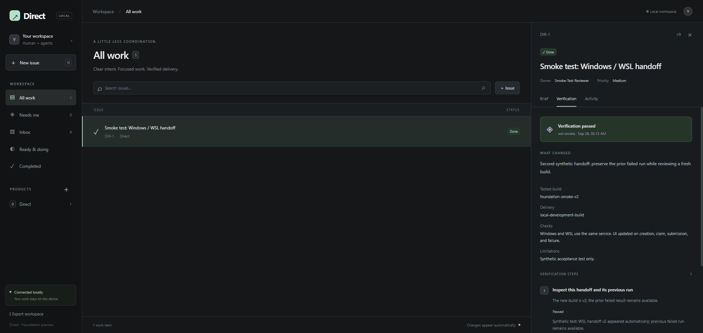

# Foundation verification — 28 September 2026

## Automated checks

- Rust workflow tests cover human-only review, all-step passing, cancellation, failure feedback, retests, reopening, and rejection of results for an old run even with a current issue version.
- Version conflicts, exact-request replay, payload/ID conflicts, and expired claims are exercised.
- A real HTTP integration test races two clients for one claim, checks agent/owner boundaries, rejects missing authentication, foreign Origin and Host, checks one-use launch grants, and verifies persistence across service restart.
- Archive round trips preserve identity, evidence, event cursors, and replay results; invalid references are rejected without changing restored data.
- Svelte type/accessibility checks and the production frontend build pass.
- All five Rust integration tests pass; workspace Clippy and Rust formatting checks pass.
- Tauri desktop compilation succeeds. Interactive native window rendering has not yet been verified.

## Browser + Windows/WSL smoke test

Used a separate `%LOCALAPPDATA%\Direct-foundation-preview` workspace, not imported Linear data or the normal Direct workspace.

1. A WSL process invoked the Windows CLI to create DIR-1. The browser showed it without reloading.
2. The owner interface supplied acceptance criteria and ownership, then made it Ready.
3. The WSL agent claimed and submitted build `foundation-smoke-v1`. Verification child DIR-2 appeared.
4. A synthetic failed step returned the parent to Doing with feedback.
5. The agent reclaimed and submitted `foundation-smoke-v2`. The previous failed run remained available.
6. A passing synthetic review completed the parent and verification child. The Needs me count returned to zero.

These records test application behavior; they do not represent Nadeem accepting the application or any real product change. The build-specific review safeguard was subsequently added and regression-tested.

After rebuilding, the browser launch script restarted the service, and the same completed issue and evidence loaded successfully. The WSL wrapper read its context. The CLI exported the two issues and two test runs, then restored them into a fresh directory without overwriting any existing workspace.



## Navigation and layout browser E2E

`scripts/e2e/navigation.browser.mjs` (DIR-53, DIR-37, DIR-40) creates a fresh isolated workspace, seeds 13 products, 32 projects, a long issue and synthetic Theoria guidance (one unavailable) through the running service, then drives the built UI at 1366×768, 1024×640 and 1920×1080: no page overflow, every product and project group reachable, pane resize/collapse/expand with mouse and keyboard, bounds, reload and corrupt/stale stored layout recovery, and issue → guidance → Back restoration of issue, filters, tab and scroll (including after a window resize and for unavailable guidance). Synthetic data only.

```sh
cargo build -p direct && (cd app && npm run build)
node scripts/e2e/navigation.browser.mjs target/debug/direct <new-dir> app/dist <evidence-dir>
```

## Intake templates browser E2E

`scripts/e2e/templates.browser.mjs` (DIR-22) creates a fresh isolated workspace with two synthetic products and labels through the running service, then drives the built UI: no templates are seeded; the owner creates an issue template with a bounded product supplement and a project template; issues and projects are created from them in both products (one with explicit priority and execution-mode overrides, one through the agent CLI); the owner revises and retires templates; old records keep revision 1 and show it is outdated; the retired template is readable but not offered; nothing becomes Ready; templates, revisions and provenance survive reload and a service restart with an identical export. Synthetic data only.

```sh
cargo build -p direct && (cd app && npm run build)
node scripts/e2e/templates.browser.mjs target/debug/direct <new-dir> app/dist <evidence-dir>
```

## Acceptance still needed

Launch the native desktop on the owner's normal workspace, create a real small task, complete it with an actual coding agent, and verify the delivered change. Test packaging, restore on a second machine, and large imported datasets before replacing Linear. Migration and project planning remain separate milestones.
